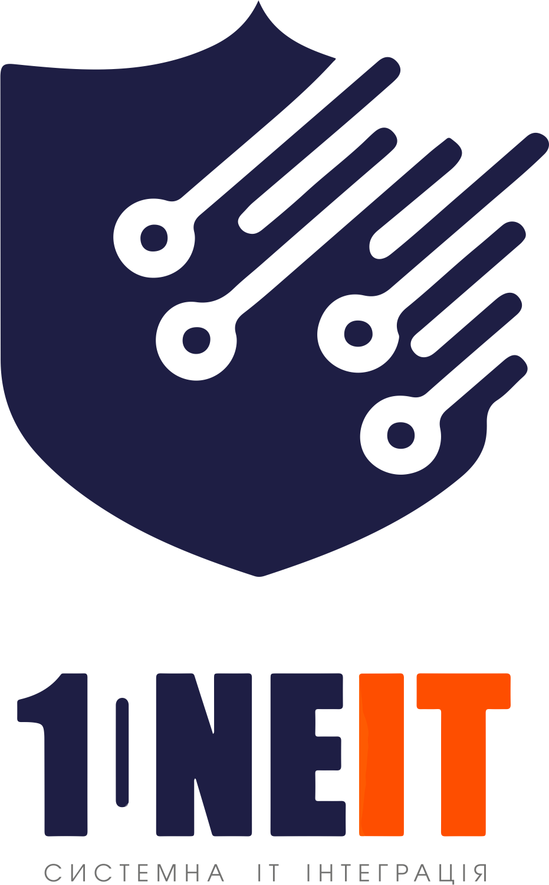

Hi, my name is Serhii Shypylov
=========================================================================================================================================

## 🙋‍♂️ About Me
- 👨‍💻  I am a Linux System administrator engineer with DevOps practices.
- 🚀 I have several certificates in Linux, Docker, Ansible and Terraform and continue to learn more. 
- 💬 I like everything related to Docker, containers and IT technologies in general. 
- 💬 I love solving complex IT solutions.
-------------------------------

* 💼 Looking for a job
* 🌍 I'm based in Poznan
* 🖥️ See my [LinkedIn](https://github.com/Shipssv83) profile 
* 👾 Chat with IT pros on [Discord](https://discord.gg/6z5EyagDyW)
* 📧 Reach me at admin@1it.pro
* 🧠 I'm learning DevOps Practices

    

        
        
    

 

### Socials

 <a href="https://github.com/Shipssv83" target="_blank" rel="noreferrer"> <picture> <source media="(prefers-color-scheme: dark)" srcset="https://raw.githubusercontent.com/danielcranney/readme-generator/main/public/icons/socials/github-dark.svg" /> <source media="(prefers-color-scheme: light)" srcset="https://raw.githubusercontent.com/danielcranney/readme-generator/main/public/icons/socials/github.svg" />  </picture> </a> <a href="https://www.linkedin.com/in/sergey-shipilov-7262a31b4/" target="_blank" rel="noreferrer"> <picture> <source media="(prefers-color-scheme: dark)" srcset="https://raw.githubusercontent.com/danielcranney/readme-generator/main/public/icons/socials/linkedin-dark.svg" /> <source media="(prefers-color-scheme: light)" srcset="https://raw.githubusercontent.com/danielcranney/readme-generator/main/public/icons/socials/linkedin.svg" />  </picture> </a>

## 📊 GitHub Stats:

&nbsp;

 

 

Show some 💜 by starring some of the repositories!
